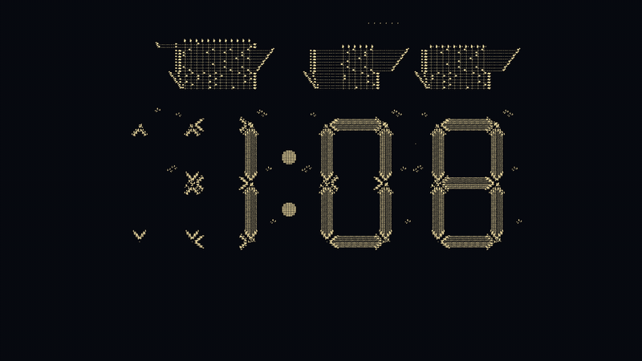
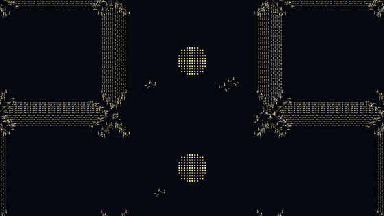

# Conway Clock

A digital clock built inside Conway's Game of Life, running in real time
behind your Windows desktop icons.

  

Up close, in the watch view at 1/4 zoom, the segments are bundles of gliders
and the colon is two discs of pulsars:

  

The pattern is dim's digital clock from the Code Golf Stack Exchange
challenge "Build a digital clock in Conway's Game of Life" (2017): a real
Life machine with a glider-gun timebase, counters, latches and lookup
tables, and a 7-segment display drawn by glider streams. Nothing about the
rules is changed; the machine computes the time. One displayed minute is
11,520 generations, so real time is 192 generations per second.

This repository runs it as a single small native program: a Hashlife
engine in C, precomputed states of the machine so it starts at the current
minute, and a window parented behind the desktop icons that draws only when
a new generation lands.

## Quick start

1. Download `life-clock.exe` from the [latest release](https://github.com/Dheirav/ConwayClock/releases/latest), or copy the `native` folder from a build.
2. Double-click `life-clock.exe`. It syncs to the current time in a second
   or two and appears behind your desktop icons.
3. Right-click the tray icon for Settings (colours, size, position, frame
   rate; changes apply live), Pause, Watch full screen
   (a window at 1/4 zoom where you can see the gliders), Start with Windows
   and Quit. Renamed to `.scr` it is a screensaver that tours the machine.

Cost with the desktop visible: about 4 % of one core at the default 6 fps,
97 MB of memory, no GPU. Nothing while a window covers the desktop.

## Documentation

- [Setup and settings](docs/SETUP.md): installation, start at login, every
  ini key, troubleshooting.
- [How it works](docs/HOW-IT-WORKS.md): the engine, wall-clock sync, how the
  window gets behind the icons on Windows 11, what the display does over a
  minute, measurements, building and regenerating.
- [Research](RESEARCH.md): the survey of hosts, engines and precomputation
  that led to this design.

## Licence

MIT for everything in this repository (see `LICENSE`). The pattern
`clock.rle` is dim's and is CC BY-SA.

## Credits

Pattern: dim, answer to "Build a digital clock in Conway's Game of Life" on
codegolf.stackexchange.com (2017), CC BY-SA. Everything else was written
for this wallpaper.
